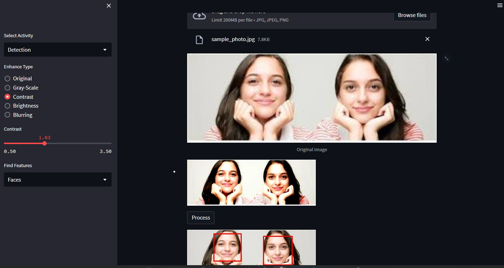

# Face Detection App

The Face Detection App is a simple web application built with Streamlit and OpenCV. It allows users to upload an image and perform various image processing operations, including face detection, image enhancement, and more.

   


## Features

- Face Detection: The app uses Haar cascade classifiers to detect faces, eyes, and smiles in the uploaded image.
- Image Enhancement: Users can enhance the uploaded image by applying different enhancements such as gray-scale conversion, contrast adjustment, brightness adjustment, and blurring.
- Image Effects: The app provides additional image effects like cartonization and edge detection using OpenCV algorithms.
- Interactive Interface: The app offers a user-friendly interface with a sidebar for selecting different activities and options.

## Installation

1. Clone the repository:

```bash
git clone https://github.com/MahtabRanjbar/FaceDetection-enhancement-openCV.git
```
2. install the required dependencies:

```bash
pip install -r requirements.txt
```

## Usage
1. run the application

```bash
streamlit run src/app.py
```

2. Open the provided URL in your web browser.

3. Select "Detection" in the sidebar to perform face detection and image processing operations.

4. Upload an image using the file uploader.

5. Adjust the image enhancement options and see the results in real-time.

6. Explore other activities and options available in the sidebar.


## Contributing
Contributions are welcome! If you have any suggestions or improvements, please feel free to submit a pull request.

## License
This project is licensed under the MIT License.

## Contact
For any questions or inquiries, please contact mahtabranjbar93@gmail.com

